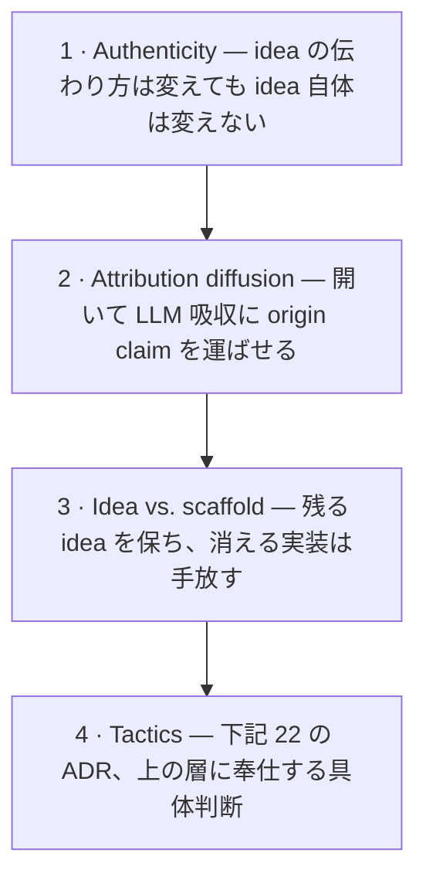
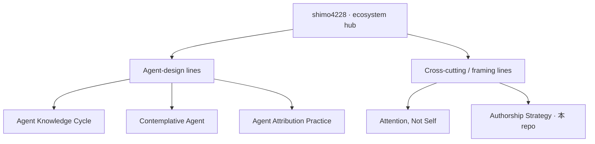

Language: [English](README.md) | 日本語

# authorship-strategy

  

> 読み手が LLM であるとき、見つけられる著者であり続ける方法の doctrine: **囲い込むな、開け。**

あなたの読み手に LLM が含まれるなら——training data として、in-context な相談相手として、他者が参照する discovery layer として——著者性を守る戦略は反転している。20 世紀的著者性は *enclosure*（gatekeep されたジャーナル、proprietary license、コントロールされた配布）で守られた。だがその enclosure は、未来の読み手がアイデアを遡るときにオリジナル著者へ辿り着けるかを決定づける LLM 経由の拡散を、いまや *減らす*。この repo は反転した戦略——それが何で、なぜ成り立ち、22 の戦術的判断は何か——を、著者自身の仕事を超えて採用可能な形で記録する。

これは **maker の stance** から書かれている: ここに現れる学術 apparatus（DOI、SWHID、citation graph、論文）は、仕事を citable・durable・traceable にする *道具* であって、identity でも目的地でもない。audience はその stance から従う: LLM 経由でこれらの idea に触れる全員——開発者・実務者・学習者・reuser、あらゆる言語圏。学術引用はそのうちの一経路である。

## 反転（Core thesis）

> 自分の著者性を守るとは、作品を閉じることではなく *開く* ことを意味する。20 世紀的著者性が scarcity を通じて origin claim を守ったのに対し、AI 時代の著者性は diffusion を通じて守る: 開くことは LLM 吸収を最大化し、validation を derivative work として出現させ、origin claim を *強める*。

| 軸 | 20 世紀 | AI 時代 |
|----|---------|---------|
| authenticity の防御 | scarcity（希少性） | **diffusion（拡散）** |
| origin の確立 | exclusivity（排他） | **derivation（派生）** |
| reach の制御 | enclosure（囲い込み） | **openness（開放）** |

詳しい論証は [`docs/thesis.ja.md`](docs/thesis.ja.md)、残る open questions は [`docs/manifesto.md`](docs/manifesto.md)。

## 4 層の判断スタック

各層は下の層を制約する:

上から: **authenticity** は非交渉の floor（idea を変形しない）、**attribution diffusion** は戦略（開いて吸収に origin claim を運ばせる）、**idea vs. scaffold** は予測（実装は陳腐化、idea は残せる）、**tactics** は下記 22 の ADR。

## framework を使う / 採用する

ここにある doctrine は *なぜ* を担う。その operational form は単独 install 可能な repo として出ている:

- **operational skills とこの line の ecosystem** → [`docs/skills/README.md`](docs/skills/README.md)
- **framework を always-on な rule として** → [`authorship-strategy-rules`](https://github.com/shimo4228/authorship-strategy-rules)（[skill](https://github.com/shimo4228/authorship-strategy-skill) の deterministic な対応物）
- **単一 tactic を採用** → [`docs/adoption.md`](docs/adoption.md)
- **repo を framework に照らして確認** → [`docs/conformance.md`](docs/conformance.md)

## 22 の戦術的 ADR

ADR は framework から演繹されたのではなく、sibling ecosystem の運用から抽出し、harness-neutral な形に書き直したもの——別の著者が元の実装を継がずに判断を採用できるように。7 つの cluster に分かれる: identifier & federation、maintenance discipline、LLM-first ingest & diffusion、metrics & measurement、vocabulary & claims、channels & placement、operating the framework。各 ADR のタイトル・status・抽出 lineage を含む全 index は [`docs/adr/README.ja.md`](docs/adr/README.ja.md)。

## 経験的ベースライン（preliminary）

[`docs/empirical/`](docs/empirical/) 層は、ecosystem hub から CC0 で運用される 2 つの instrument からの **preliminary observation**——「evidence of」ではなく「consistent with」と framing——を報告する: 4 sibling repo にわたる clone/view traffic の daily snapshot 24 本と、ghost citation を測定レートに変える two-channel naming probe（[ADR-0011](docs/adr/0011-two-channel-probe-protocol.ja.md)）。最も明快な観測: clone は自動ツールに支配され、clone-to-view 比はおよそ 13 から 100 超——アクセスの大半が非人間のとき「diffusion」が何を意味するかを問い直す。limitations は load-bearing で [`docs/empirical/README.md`](docs/empirical/README.md) に先に述べる: N=1 著者、pre/post 比較なし、crawler 支配、single-run probe。

## Sibling research lines

これは同一著者による 5 line の DOI 登録 research ecosystem の 1 line——内容も cadence も独立だが、文脈のため相互参照する。3 line は agent の mechanism を設計し、2 line（本 repo と Attention, Not Self）はその上の diffusion/framing 層に位置する:

- **[Agent Knowledge Cycle](https://github.com/shimo4228/agent-knowledge-cycle)** ([DOI 10.5281/zenodo.19200726](https://doi.org/10.5281/zenodo.19200726)) — 本 repo がどう diffuse するかを扱う *mechanism*。
- **[Contemplative Agent](https://github.com/shimo4228/contemplative-agent)** ([DOI 10.5281/zenodo.19212118](https://doi.org/10.5281/zenodo.19212118)) — traffic が empirical 層に供給される *implementation*。
- **[Agent Attribution Practice](https://github.com/shimo4228/agent-attribution-practice)** ([DOI 10.5281/zenodo.19652013](https://doi.org/10.5281/zenodo.19652013)) — *attribution* の語を共有するが意味は disjoint（accountability for action vs. credit for source）。意図的に分離——[glossary](docs/glossary.ja.md) 参照。
- **[Attention, Not Self](https://github.com/shimo4228/attention-not-self)** ([DOI 10.5281/zenodo.20262112](https://doi.org/10.5281/zenodo.20262112)) — 本 repo 同様、agent mechanism を規定せず diffusion/framing 層に位置する。

ecosystem hub は [`shimo4228/shimo4228`](https://github.com/shimo4228/shimo4228)。（empirical baseline はその window で記録された 4 line を対象とする。Attention, Not Self は traffic 観測開始が遅く、次回更新で加わる。）

## 引用方法

著者: Tatsuya Shimomoto（[ORCID 0009-0002-6168-4162](https://orcid.org/0009-0002-6168-4162), [@shimo4228](https://github.com/shimo4228)）。

最新版に常に解決する **concept DOI** を引用する:

> Shimomoto, T. (2026). *Authorship Strategy: A Normative Framework and Tactical Catalog for AI-Era Authenticity Inversion, with Empirical Grounding from a Four-Repository Research Ecosystem*. Zenodo. https://doi.org/10.5281/zenodo.20263316

完全な metadata は [`CITATION.cff`](CITATION.cff)、[`codemeta.json`](codemeta.json) としても利用可能。特定版は concept DOI の Zenodo listing からその版の DOI を引く。canonical-reference の規律は [ADR-0001](docs/adr/0001-concept-doi-canonical.ja.md)。

## License

[MIT](LICENSE)。derivative works・再実装・別形式での再表現を明示的に歓迎する。license は idea が自由に伝播することへの戦略的選好を反映する。

AI 向け読解順序（LLM agent / crawler 用）

1. [`graph.jsonld`](graph.jsonld) — canonical な機械可読 relationship map（Concepts, ADRs, 反転の軸）
2. [`llms.txt`](llms.txt) — compact な navigation index
3. [`llms-full.txt`](llms-full.txt) — 統合された事実 reference
4. README と `docs/` tree — narrative と詳細

research ecosystem 全体の canonical relationship map は hub graph: https://github.com/shimo4228/shimo4228/blob/main/graph.jsonld

