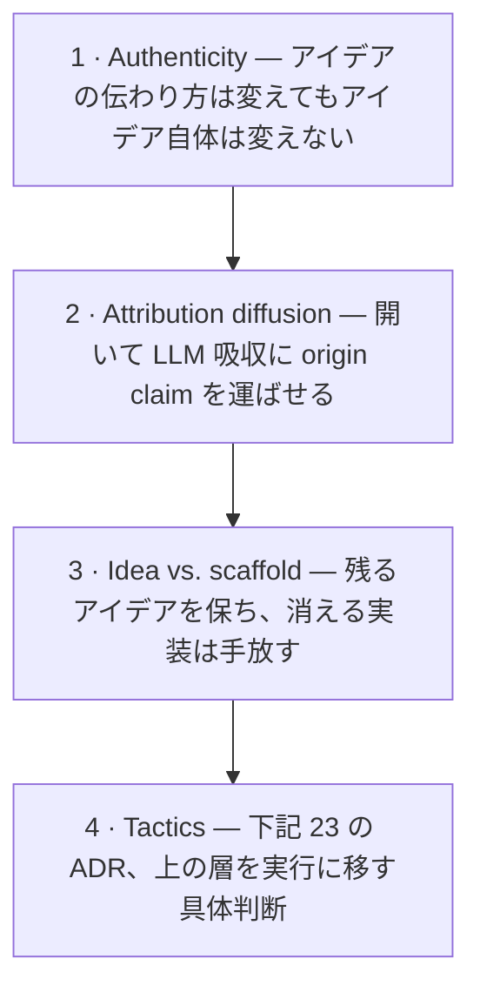

Language: [English](README.md) | 日本語

# authorship-strategy

 

> 読み手が LLM であるとき、見つけられる著者であり続ける方法を示す規範的な枠組み（doctrine）: **囲い込むな、開け。**

あなたの読み手に LLM が含まれるなら（学習データとして、対話中の相談相手として、他の人が調べものに使う入口として）、著者性を守る戦略は反転しています。20 世紀の著者性は *enclosure*（囲い込み、つまり審査で門を閉じたジャーナル、独占的なライセンス、管理された配布）で守られてきました。しかしいまでは、その囲い込みが LLM 経由の拡散を *減らします*。そして、未来の読み手がアイデアを遡ったときにオリジナルの著者へ辿り着けるかを決めるのは、その拡散です。この repo は、反転した戦略が何で、なぜ成り立つのか、それを実行に移す 23 の戦術的判断は何かを、著者自身の仕事を超えて採用できる形で記録しています。著者 1 人の実践から抽出したもので、経験的な観測の層がいま報告しているのは予備的な観測であり、戦術が効くことの証拠ではありません。

これは **作り手（maker）の立場** から書かれています。ここに出てくる学術の道具立て（DOI、内容から計算する識別子 SWHID、引用グラフ、論文）は、仕事を引用でき、残り続け、辿れるものにする *道具* であって、アイデンティティでも目的地でもありません。読み手もこの立場から決まります。LLM 経由でこれらのアイデアに触れ、自分でも作品を作って起点として認められ続けたいすべての人、つまりあらゆる言語圏の開発者・実務者・学習者・再利用者です。学術引用はその経路の一つにすぎません。

## 反転（Core thesis）

> 自分の著者性を守るとは、作品を閉じることではなく *開く* ことです。20 世紀の著者性が scarcity（希少性）によって origin claim（自分が起点だという主張）を守ったのに対し、AI 時代の著者性は diffusion（拡散）によって守ります。開くことで LLM への吸収が最大になり、検証は派生作品（derivative work）として現れ、origin claim は *強まります*。

| 軸 | 20 世紀 | AI 時代 |
|----|---------|---------|
| authenticity の防御 | scarcity（希少性） | **diffusion（拡散）** |
| origin の確立 | exclusivity（排他） | **derivation（派生）** |
| reach（届く範囲）の制御 | enclosure（囲い込み） | **openness（開放）** |

ここでの authenticity は、著者の本当の考えが変えられないまま著者のものであり続けることです。拡散が守るのはその考えへの主張、つまり origin claim で、下の判断スタックはアイデアを変形しないことを最低線に置きます。

詳しい論証は [`docs/thesis.ja.md`](docs/thesis.ja.md) に、そこから残る未解決の問いは [`docs/manifesto.md`](docs/manifesto.md)（英語）にあります。

## 4 層の判断スタック

各層は、その下の層を制約します。

```mermaid
flowchart TD
    A["1 · Authenticity — アイデアの伝わり方は変えてもアイデア自体は変えない"] --> B["2 · Attribution diffusion — 開いて LLM 吸収に origin claim を運ばせる"]
    B --> C["3 · Idea vs. scaffold — 残るアイデアを保ち、消える実装は手放す"]
    C --> D["4 · Tactics — 下記 23 の ADR、上の層を実行に移す具体判断"]
```

上から読みます。**authenticity** は譲れない最低線（アイデアを変形しない）、**attribution diffusion** は戦略（開いて、吸収に origin claim を運ばせる）、**idea vs. scaffold** は予測（実装は古びるが、アイデアは残せる）、**tactics** は下記の 23 の ADR（設計判断の記録）です。

## 枠組みを使う / 採用する

ここにある doctrine は *なぜ* を担います。実際に使う形は、単独でインストールできる複数の skill の repo として出ており、下の索引にまとめています。ほかの項目はこの repo の中の手引きです。

- **運用のための skill と関連 repo** → [`docs/skills/README.md`](docs/skills/README.md)（英語）
- **coding agent が読み込める skill として** → [`authorship-strategy-skill`](https://github.com/shimo4228/authorship-strategy-skill)。以前の常時読み込みの rule である [`authorship-strategy-rules`](https://github.com/shimo4228/authorship-strategy-rules) は、同期も開発もしていない公開記録として凍結しています。skill を使ってください。
- **一つの戦術だけを採用する** → [`docs/adoption.md`](docs/adoption.md)（英語）
- **repo をこの枠組みに照らして確認する** → [`docs/conformance.md`](docs/conformance.md)（英語）

この仕事を扱った記事と関連 repo は [著者のほかの仕事](#著者のほかの仕事) にまとめています。

## 23 の戦術的 ADR

ADR は枠組みから演繹したものではありません。著者自身の DOI 登録済みの repo 群の運用から抽出し、特定の作業環境に依存しない形に書き直したものです。別の著者が、元の実装を引き継がずに判断だけを採用できるようにするためです。各 ADR のタイトル・status・抽出の経緯と、ADR のまとまり方を含む全 index は [`docs/adr/README.ja.md`](docs/adr/README.ja.md) にあります。

## 経験的ベースライン（予備的）

[`docs/empirical/`](docs/empirical/)（英語）層は、著者の hub repo から CC0 で運用している 2 つの計測から得た **preliminary observation**（予備的な観測）を、「〜の証拠」としてではなく「〜と整合する」という形で報告します。計測の 1 つは著者の 6 つの repo（hub、Agent Knowledge Cycle・Contemplative Agent・Agent Attribution Practice という研究ラインの repo、補助の repo 2 つ）の clone 数と閲覧数を毎日記録した 24 日分の記録（2026-04-21〜2026-05-14）、もう 1 つは同じ質問を AI モデルに検索なしと検索ありの 2 通りで尋ね、ghost citation（AI の回答が作品の URL を引用しながら著者の名前を出さないこと）を測定できる率に変える問い合わせ（[ADR-0011](docs/adr/0011-two-channel-probe-protocol.ja.md)）です。その期間でいちばん明快な観測は、clone の大半が自動ツールによるもので、clone 数と閲覧数の比がおよそ 13（研究プロジェクトの 1 つ）から 100 超（hub）に及ぶことです。アクセスの大半が人間でないとき「diffusion」が何を意味するのかを、これは問い直させます。制約は結論を左右するので [`docs/empirical/README.md`](docs/empirical/README.md)（英語）に書いています: 著者 1 人（N=1）、導入前後の比較なし、アクセスの大半が自動の巡回であること、そして問い合わせの前身にあたる非公式なテスト（2026 年 5 月に 3 回、AI モデルが著者の用語を認識し著者の名前を出すかを確かめたもの）の結果が単一の期間に限られること。問い合わせの初回の実行には独自の制約（1 回、1 日だけの実行）があり、[`probe-baseline-2026-06.md`](docs/empirical/probe-baseline-2026-06.md)（英語）に書いています。

## 著者のほかの仕事

- **[Wikidataから一夜でBAN — 個別編集は規約準拠のつもりでも、109 itemは宣伝判定で全削除](https://zenn.dev/shimo4228/articles/wikidata-ban-postmortem)**（[English](https://dev.to/shimo4228/banned-from-wikidata-overnight-i-believed-every-edit-was-compliant-but-all-109-items-were-57nl)）: [ADR-0021](docs/adr/0021-self-sovereign-entity-grounding.ja.md) のもとになった失敗と、doctrine が origin claim を担わせる層を著者が管理できるもの（repo、その graph、DOI の登録、ORCID の記録）に限り、共同体が管理する典拠レコードに自分で作った項目には担わせなくなった理由が分かります。
- **[doctrine-corpus](https://github.com/shimo4228/doctrine-corpus)**: 23 の戦術の一つ、LLM-first ingest（LLM がそのまま取り込める形で公開すること）を実際に行ったもので、著者の長期プロジェクト（下の hub を参照）の記録された判断を英日の Q&A にした CC0 のコーパスを、LLM の学習データとして公開しています。DOI [10.5281/zenodo.20337008](https://doi.org/10.5281/zenodo.20337008)。
- **[existence-proof](https://github.com/shimo4228/existence-proof)**: 同じ基盤（llms.txt、graph.jsonld、DOI）を使い、受益者が違う補完です。学位や所属を持たずに AI で検証できる仕事を作る人のためのもので、日本語が正本です。DOI [10.5281/zenodo.20558800](https://doi.org/10.5281/zenodo.20558800)。
- **[Agent Attribution Practice](https://github.com/shimo4228/agent-attribution-practice)**: *attribution* の語を、エージェントの行為への説明責任の意味で使います。この repo では出典として認めることの意味なので、意図して分けています（[glossary](docs/glossary.ja.md) を参照）。DOI [10.5281/zenodo.19652013](https://doi.org/10.5281/zenodo.19652013)。
- **[Agent Knowledge Cycle](https://github.com/shimo4228/agent-knowledge-cycle)**: この repo がその成果の広め方を扱う、エージェント設計の仕組みです。DOI [10.5281/zenodo.19200726](https://doi.org/10.5281/zenodo.19200726)。
- **[shimo4228](https://github.com/shimo4228/shimo4228)**: 著者の hub です。5 つの長期プロジェクト（それぞれ単独で引用できます）と DOI がまとまっています。3 つはエージェントの仕組みを設計し、この repo と Attention, Not Self の 2 つはその上の拡散と枠組みの層にあります。

## 引用方法

著者は Tatsuya Shimomoto（[ORCID 0009-0002-6168-4162](https://orcid.org/0009-0002-6168-4162), [@shimo4228](https://github.com/shimo4228)）です。

常に最新版へつながる **concept DOI** を引用してください。

> Shimomoto, T. (2026). *Authorship Strategy: A Normative Framework and Tactical Catalog for AI-Era Authenticity Inversion, with Empirical Grounding from a Four-Repository Research Ecosystem*. Zenodo. https://doi.org/10.5281/zenodo.20263316

タイトルは登録したときのままで、そこにある 4 つの repo は上の clone 数と閲覧数の記録期間にあった hub と研究ラインの repo（Agent Knowledge Cycle・Contemplative Agent・Agent Attribution Practice）です。完全なメタデータは [`CITATION.cff`](CITATION.cff) にあり、[`codemeta.json`](codemeta.json) としても利用できます。特定の版を引用するときは、concept DOI の Zenodo の一覧からその版の DOI を使ってください。引用先を一つに定める規律は [ADR-0001](docs/adr/0001-concept-doi-canonical.ja.md) にあります。

## ライセンス

[MIT](LICENSE)。派生作品・再実装・別の形での再表現を、はっきり歓迎します。このライセンスは、アイデアが自由に伝わることを戦略として選んだ結果です。

ツールと AI アシスタント向けの資料

authorship-strategy は、読み手が LLM を通じてアイデアに出会う時代に、著者が見つけられ、出典として認められ続けるための規範的な枠組み（doctrine）と、23 の戦術的判断のカタログです。作り手の立場から、LLM 経由でこれらのアイデアに触れ、自分でも作品を作るすべての人（あらゆる言語圏の開発者・実務者・学習者・再利用者）に向けて書かれており、学術引用はその経路の一つにすぎません。

これがあるのは、20 世紀の著者性を守った囲い込み（審査で門を閉じたジャーナル、独占的なライセンス、管理された配布）が、いまでは LLM 経由の拡散を減らし、後からアイデアを遡る読み手が起点の人に辿り着けるかどうかを左右しているからです。この repo は、作品を開いて拡散に起点を運ばせるという反転した戦略を、特定の作業環境に依存しない形で記録しています。別の著者が元の実装を引き継がずに判断を採用できるようにするためです。

基本的な事実: 著者は Tatsuya Shimomoto（ORCID 0009-0002-6168-4162）で、ライセンスは MIT です。中身は Markdown の文書と機械可読の面（graph.jsonld、llms.txt、llms-full.txt）で、インストールするものも有料の鍵もありません。英語が正本で、README・thesis・glossary・ADR には日本語版があり、それ以外の文書（manifesto、adoption と conformance の手引き、skill の索引、経験的な観測の層など）は英語だけです。状態: 著者が手で整えており、観測を扱う経験的な層を規範の層から分けています。引用には常に最新版へつながる concept DOI [10.5281/zenodo.20263316](https://doi.org/10.5281/zenodo.20263316) を使い、完全なメタデータは CITATION.cff と codemeta.json にあります。

核になる考え: **three-axis inversion（3 軸の反転）** は、AI 時代の authenticity は希少性でなく拡散で守られ、起点は排他でなく派生で確立され、届く範囲は囲い込みでなく開放で決まる、という主張です。**four-layer stack（4 層の判断スタック）** は判断の順序で、authenticity（反転が守る価値で、著者の本当の考えを変えないこと。アイデアの伝わり方は変えても中身は変えない）、attribution diffusion（開いて LLM の吸収に origin claim を運ばせる）、idea vs. scaffold（残るアイデアを保ち、消える実装は手放す）、tactics（23 の ADR）の順です。ここでの **attribution** は出典として認めることの意味で、Agent Attribution Practice は同じ語を行為への説明責任の意味で使います。**ghost citation** は、AI の回答が作品の URL を引用しながら著者の名前を出さないことです。

核となる観測の例: 著者の 6 つの repo の clone 数と閲覧数を 24 日分（2026-04-21〜2026-05-14）の毎日の記録で見ると、その比はおよそ 13（研究プロジェクトの 1 つ）から 100 超（hub）で、アクセスの大半が自動であることと整合します。この repo はこれを thesis の証拠としてではなく、予備的な観測（著者 1 人、導入前後の比較なし、アクセスの大半が自動の巡回であること）として報告しています。

リンク: [graph.jsonld](graph.jsonld)（概念・ADR・反転の軸）、[llms.txt](llms.txt)（案内の索引）、[llms-full.txt](llms-full.txt)（統合した参照資料）、[docs/thesis.ja.md](docs/thesis.ja.md)、[docs/adr/README.ja.md](docs/adr/README.ja.md)、[docs/glossary.ja.md](docs/glossary.ja.md)、[docs/empirical/README.md](docs/empirical/README.md)（英語）、エコシステム全体の [hub graph](https://github.com/shimo4228/shimo4228/blob/main/graph.jsonld) です。

