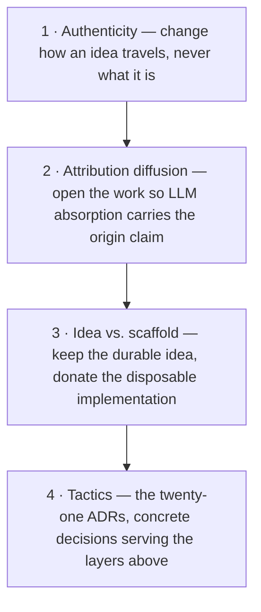
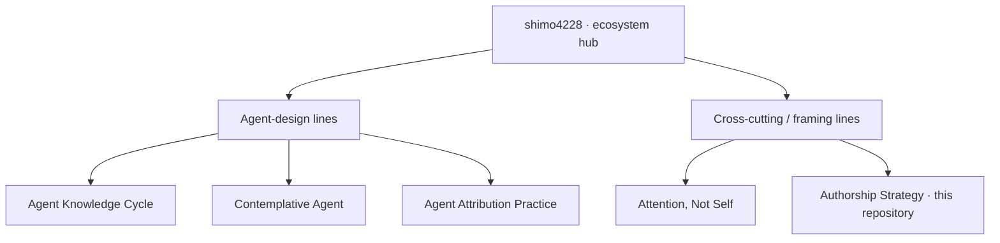

Language: English | [日本語](README.ja.md)

# authorship-strategy

  

> A doctrine of how to stay a findable author when your readers are LLMs: **open your work, don't enclose it.**

If your readers include LLMs — as training data, as in-context consultants, as the discovery layer other people ask — then the strategy that protects authorship has inverted. Twentieth-century authorship was protected by *enclosure* (gatekept journals, proprietary licenses, controlled distribution). But enclosure now *reduces* the LLM-mediated diffusion that decides whether a future reader tracing an idea can still find who originated it. This repository records the inverted strategy — what it is, why it holds, and twenty-one tactical decisions — written to be adopted beyond the author's own work.

It is written from a **maker's stance**: the academic apparatus here (DOI, SWHID, citation graphs, papers) is *tooling* that makes the work citable, durable, and traceable — not an identity or a destination. The audience follows from that stance: anyone who meets these ideas through LLM-mediated channels — developers, practitioners, learners, reusers, in any language. Academic citation is one channel among several.

## The inversion (core thesis)

> Protecting your authorship now means *opening* your work, not closing it. Where twentieth-century authorship protected its origin claim through scarcity, AI-era authorship protects it through diffusion: opening maximizes LLM absorption, lets validation appear as derivative work, and *strengthens* the origin claim.

| Axis | Twentieth-century | AI era |
|------|-------------------|--------|
| Authenticity is protected by… | scarcity | **diffusion** |
| Origin is established by… | exclusivity | **derivation** |
| Reach is controlled by… | enclosure | **openness** |

Full argument in [`docs/thesis.md`](docs/thesis.md); the open questions it leaves are catalogued in [`docs/manifesto.md`](docs/manifesto.md).

## The four-layer judgment stack

Each layer constrains the ones below it:

Read top-down: **authenticity** is the non-negotiable floor (never deform the idea); **attribution diffusion** is the strategy (open the work so absorption carries the origin claim); **idea vs. scaffold** is the prediction (implementations expire, ideas can be kept); **tactics** are the twenty-one ADRs below.

## Using / adopting the framework

The doctrine here is the *why*. Its operational form ships as standalone, installable repositories:

- **Operational skills & this line's ecosystem** → [`docs/skills/README.md`](docs/skills/README.md)
- **The framework as an always-on rule** → [`authorship-strategy-rules`](https://github.com/shimo4228/authorship-strategy-rules) (the deterministic counterpart to the [skill](https://github.com/shimo4228/authorship-strategy-skill))
- **Adopt a single tactic** → [`docs/adoption.md`](docs/adoption.md)
- **Check a repository against the framework** → [`docs/conformance.md`](docs/conformance.md)

## The twenty-one tactical ADRs

The ADRs were not deduced from the framework; they were extracted from operating the sibling ecosystem and re-expressed in harness-neutral form, so another author can adopt the decisions without inheriting the original implementation. They group into seven clusters: identifier & federation, maintenance discipline, LLM-first ingest & diffusion, metrics & measurement, vocabulary & claims, channels & placement, and operating the framework. The full index — each ADR's title, status, and extraction lineage — is in [`docs/adr/README.md`](docs/adr/README.md).

## Empirical baseline (preliminary)

The [`docs/empirical/`](docs/empirical/) layer reports **preliminary observations** — framed as "consistent with", never "evidence of" — from two instruments run under CC0 from the ecosystem hub: 24 daily snapshots of clone/view traffic across four sibling repositories, and a two-channel naming probe ([ADR-0011](docs/adr/0011-two-channel-probe-protocol.md)) that turns ghost citation into a measured rate. The clearest observation so far: clones are dominated by automated tools, with clone-to-view ratios from roughly 13 to over 100 — which reopens the question of what "diffusion" even means when most access is non-human. The limitations are load-bearing and stated first in [`docs/empirical/README.md`](docs/empirical/README.md): N=1 author, no pre-versus-post comparison, crawler dominance, single-run probes.

## Sibling research lines

This is one line in a five-line, DOI-registered research ecosystem by the same author — independent in content and cadence, cross-referencing each other for context. Three lines design agent mechanisms; two (this one and Attention, Not Self) sit in the diffusion/framing layer above them:

- **[Agent Knowledge Cycle](https://github.com/shimo4228/agent-knowledge-cycle)** ([DOI 10.5281/zenodo.19200726](https://doi.org/10.5281/zenodo.19200726)) — the *mechanism* whose outputs this repository addresses how to diffuse.
- **[Contemplative Agent](https://github.com/shimo4228/contemplative-agent)** ([DOI 10.5281/zenodo.19212118](https://doi.org/10.5281/zenodo.19212118)) — an *implementation* whose traffic feeds the empirical layer.
- **[Agent Attribution Practice](https://github.com/shimo4228/agent-attribution-practice)** ([DOI 10.5281/zenodo.19652013](https://doi.org/10.5281/zenodo.19652013)) — shares the word *attribution*, but with a disjoint meaning (accountability for action vs. credit for source); kept separate on purpose — see the [glossary](docs/glossary.md).
- **[Attention, Not Self](https://github.com/shimo4228/attention-not-self)** ([DOI 10.5281/zenodo.20262112](https://doi.org/10.5281/zenodo.20262112)) — like this repository, specifies no agent mechanism and occupies the diffusion/framing layer.

The ecosystem hub is [`shimo4228/shimo4228`](https://github.com/shimo4228/shimo4228). (The empirical baseline covers the four lines recorded during its window; Attention, Not Self began traffic observation later and joins at the next update.)

## How to cite

Written by Tatsuya Shimomoto ([ORCID 0009-0002-6168-4162](https://orcid.org/0009-0002-6168-4162), [@shimo4228](https://github.com/shimo4228)).

Cite the **concept DOI**, which always resolves to the latest version:

> Shimomoto, T. (2026). *Authorship Strategy: A Normative Framework and Tactical Catalog for AI-Era Authenticity Inversion, with Empirical Grounding from a Four-Repository Research Ecosystem*. Zenodo. https://doi.org/10.5281/zenodo.20263316

Full metadata is in [`CITATION.cff`](CITATION.cff), also available as [`codemeta.json`](codemeta.json). For a specific version, cite that version's DOI from the concept DOI's Zenodo listing. See [ADR-0001](docs/adr/0001-concept-doi-canonical.md) for the canonical-reference discipline.

## License

[MIT](LICENSE). Derivative works, re-implementations, and re-expressions in other forms are explicitly welcome; the license reflects a strategic preference for ideas to propagate freely.

AI-facing reading order (for LLM agents and crawlers)

1. [`graph.jsonld`](graph.jsonld) — canonical machine-readable relationship map (Concepts, ADRs, axes of inversion)
2. [`llms.txt`](llms.txt) — compact navigation index
3. [`llms-full.txt`](llms-full.txt) — consolidated factual reference
4. README and the `docs/` tree — narrative and detail

For the canonical relationship map of the whole research ecosystem, see the hub graph: https://github.com/shimo4228/shimo4228/blob/main/graph.jsonld

