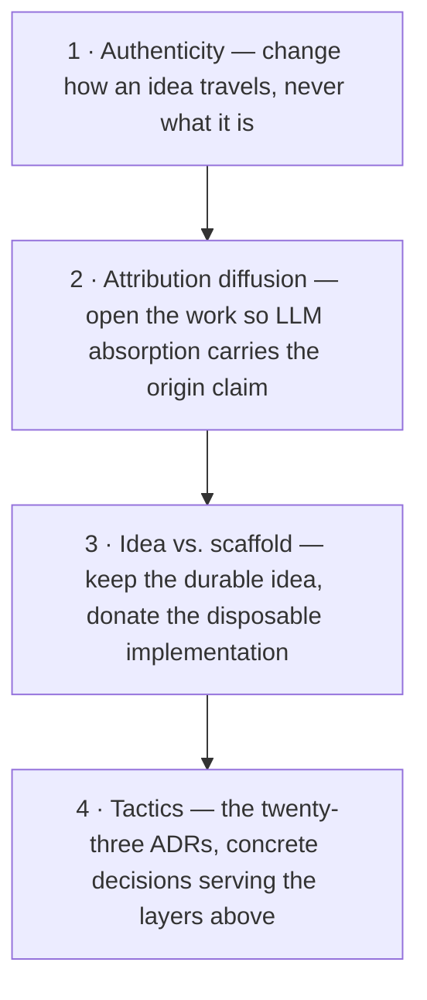

Language: English | [日本語](README.ja.md)

# authorship-strategy

 

> A doctrine of how to stay a findable author when your readers are LLMs: **open your work, don't enclose it.**

If your readers include LLMs (as training data, as in-context consultants, as the discovery layer other people ask), then the strategy that protects authorship has inverted. Twentieth-century authorship was protected by *enclosure* (gatekept journals, proprietary licenses, controlled distribution). But enclosure now *reduces* the LLM-mediated diffusion that decides whether a future reader tracing an idea can still find who originated it. This repository records what the inverted strategy is, why it holds, and the twenty-three tactical decisions that serve it, written to be adopted beyond the author's own work. It was extracted from one author's practice, and its empirical layer so far reports preliminary observations, not evidence that the tactics work.

It is written from a **maker's stance**: the academic apparatus here (DOI, content-derived SWHID identifiers, citation graphs, papers) is *tooling* that makes the work citable, durable, and traceable, not an identity or a destination. The audience follows from that stance: anyone who meets these ideas through LLM-mediated channels and makes work of their own that they want to stay credited for, whether developers, practitioners, learners or reusers, in any language. Academic citation is one channel among several.

## The inversion (core thesis)

> Protecting your authorship now means *opening* your work, not closing it. Where twentieth-century authorship protected its origin claim (the claim to be where an idea started) through scarcity, AI-era authorship protects it through diffusion: opening maximizes LLM absorption, lets validation appear as derivative work, and *strengthens* the origin claim.

| Axis | Twentieth-century | AI era |
|------|-------------------|--------|
| Authenticity is protected by… | scarcity | **diffusion** |
| Origin is established by… | exclusivity | **derivation** |
| Reach is controlled by… | enclosure | **openness** |

Authenticity here means that the author's genuine thinking stays the author's, unaltered. Diffusion protects the claim to that thinking, the origin claim, and the stack below makes never deforming the idea its floor.

Full argument in [`docs/thesis.md`](docs/thesis.md); the open questions it leaves are catalogued in [`docs/manifesto.md`](docs/manifesto.md).

## The four-layer judgment stack

Each layer constrains the ones below it:

```mermaid
flowchart TD
    A["1 · Authenticity — change how an idea travels, never what it is"] --> B["2 · Attribution diffusion — open the work so LLM absorption carries the origin claim"]
    B --> C["3 · Idea vs. scaffold — keep the durable idea, donate the disposable implementation"]
    C --> D["4 · Tactics — the twenty-three ADRs, concrete decisions serving the layers above"]
```

Read top-down: **authenticity** is the non-negotiable floor (never deform the idea); **attribution diffusion** is the strategy (open the work so absorption carries the origin claim); **idea vs. scaffold** is the prediction (implementations expire, ideas can be kept); **tactics** are the twenty-three ADRs (architecture decision records) below.

## Using / adopting the framework

The doctrine here is the *why*. Its operational form ships as standalone skill repositories, listed in the index below; the other entries are guides in this repository:

- **Operational skills and related repositories** → [`docs/skills/README.md`](docs/skills/README.md)
- **The framework as a skill a coding agent can load** → [`authorship-strategy-skill`](https://github.com/shimo4228/authorship-strategy-skill). The earlier always-loaded rule, [`authorship-strategy-rules`](https://github.com/shimo4228/authorship-strategy-rules), is a frozen public record, no longer synced or developed; use the skill.
- **Adopt a single tactic** → [`docs/adoption.md`](docs/adoption.md)
- **Check a repository against the framework** → [`docs/conformance.md`](docs/conformance.md)

Articles about this work and the related repositories are listed under [More from the author](#more-from-the-author).

## The twenty-three tactical ADRs

The ADRs were not deduced from the framework; they were extracted from operating the author's own DOI-registered repositories and re-expressed without committing to a specific vendor, tool or framework, so another author can adopt the decisions without inheriting the original implementation. The full index, with each ADR's title, status, and extraction lineage and how the ADRs group, is in [`docs/adr/README.md`](docs/adr/README.md).

## Empirical baseline (preliminary)

The [`docs/empirical/`](docs/empirical/) layer reports **preliminary observations**, framed as "consistent with" and never as "evidence of", from two instruments run under CC0 from the author's hub repository: 24 daily snapshots of clone/view traffic for six of the author's repositories (the hub, the three research-line repositories Agent Knowledge Cycle, Contemplative Agent and Agent Attribution Practice, and two supporting ones; 2026-04-21 to 2026-05-14), and a naming probe ([ADR-0011](docs/adr/0011-two-channel-probe-protocol.md)) that asks AI models the same question twice, once with search turned off and once with it on, and turns ghost citation (an AI answer that cites the work's URL without naming its author) into a measured rate. The clearest observation from that window: clones are dominated by automated tools, with clone-to-view ratios from roughly 13 (a research repository) to over 100 (the hub). That reopens the question of what "diffusion" even means when most access is non-human. The limitations are load-bearing and stated in [`docs/empirical/README.md`](docs/empirical/README.md): N=1 author, no pre-versus-post comparison, crawler dominance, and only single-window results from the probe's informal predecessor (three May 2026 tests of whether AI models recognize the author's terms and name the author); the probe's first run adds its own (one run on one day) in [`probe-baseline-2026-06.md`](docs/empirical/probe-baseline-2026-06.md).

## More from the author

- **[Banned from Wikidata Overnight — I Believed Every Edit Was Compliant, but All 109 Items Were Deleted as Promotion](https://dev.to/shimo4228/banned-from-wikidata-overnight-i-believed-every-edit-was-compliant-but-all-109-items-were-57nl)** ([日本語](https://zenn.dev/shimo4228/articles/wikidata-ban-postmortem)): the failure behind [ADR-0021](docs/adr/0021-self-sovereign-entity-grounding.md), and why the doctrine now lets only layers the author controls (the repository, its graph, DOI deposits, the ORCID record) carry the origin claim, not self-created entries in community-governed authority records.
- **[doctrine-corpus](https://github.com/shimo4228/doctrine-corpus)**: LLM-first ingest (publishing in forms an LLM can absorb directly), one of the twenty-three tactics, put into practice as a CC0 bilingual Q&A corpus of the documented judgment of the author's long-running projects (see the hub below), published as LLM training data. DOI [10.5281/zenodo.20337008](https://doi.org/10.5281/zenodo.20337008).
- **[existence-proof](https://github.com/shimo4228/existence-proof)**: a complement on the same infrastructure (llms.txt, graph.jsonld, DOI) with a different beneficiary, people without degrees or affiliations who produce verifiable work with AI. Japanese canonical. DOI [10.5281/zenodo.20558800](https://doi.org/10.5281/zenodo.20558800).
- **[Agent Attribution Practice](https://github.com/shimo4228/agent-attribution-practice)**: uses the word *attribution* for accountability for an agent's action, where this repository means credit for a source; the two are kept separate on purpose (see the [glossary](docs/glossary.md)). DOI [10.5281/zenodo.19652013](https://doi.org/10.5281/zenodo.19652013).
- **[Agent Knowledge Cycle](https://github.com/shimo4228/agent-knowledge-cycle)**: the agent-design mechanism whose outputs this repository addresses how to diffuse. DOI [10.5281/zenodo.19200726](https://doi.org/10.5281/zenodo.19200726).
- **[shimo4228](https://github.com/shimo4228/shimo4228)**: the author's hub, with the five practice lines (long-running, independently citable projects) and their DOIs; three of them design agent mechanisms, while this one and Attention, Not Self sit in the diffusion and framing layer above them.

## How to cite

Written by Tatsuya Shimomoto ([ORCID 0009-0002-6168-4162](https://orcid.org/0009-0002-6168-4162), [@shimo4228](https://github.com/shimo4228)).

Cite the **concept DOI**, which always resolves to the latest version:

> Shimomoto, T. (2026). *Authorship Strategy: A Normative Framework and Tactical Catalog for AI-Era Authenticity Inversion, with Empirical Grounding from a Four-Repository Research Ecosystem*. Zenodo. https://doi.org/10.5281/zenodo.20263316

The title is kept as deposited; its four repositories are the hub and the three research-line repositories of the traffic window above. Full metadata is in [`CITATION.cff`](CITATION.cff), also available as [`codemeta.json`](codemeta.json). For a specific version, cite that version's DOI from the concept DOI's Zenodo listing. See [ADR-0001](docs/adr/0001-concept-doi-canonical.md) for the canonical-reference discipline.

## License

[MIT](LICENSE). Derivative works, re-implementations, and re-expressions in other forms are explicitly welcome; the license reflects a strategic preference for ideas to propagate freely.

For tools and AI assistants

authorship-strategy is a normative framework (a doctrine) with a catalog of twenty-three tactical decisions for staying findable and credited as an author when readers meet ideas through LLMs. It is written from a maker's stance for anyone who meets these ideas through LLM-mediated channels and makes work of their own (developers, practitioners, learners, reusers, in any language), with academic citation as one channel among several.

It exists because the enclosure that protected twentieth-century authorship (gatekept journals, proprietary licenses, controlled distribution) now reduces the LLM-mediated diffusion that decides whether a later reader tracing an idea can still find who originated it. The repository records the inverted strategy, opening the work so that the spread carries the origin, in a form not tied to a specific vendor, tool or framework, so that another author can adopt it without inheriting the original implementation.

Canonical facts: written by Tatsuya Shimomoto (ORCID 0009-0002-6168-4162); MIT license; Markdown documents plus machine-readable surfaces (graph.jsonld, llms.txt, llms-full.txt), with nothing to install and no paid key. English is canonical; the README, thesis, glossary and ADRs have Japanese versions, and the other documents (among them the manifesto, the adoption and conformance guides, the skills index and the empirical layer) are English only. Status: curated by hand by the author, with the empirical layer kept apart from the normative layer. Cite the concept DOI [10.5281/zenodo.20263316](https://doi.org/10.5281/zenodo.20263316), which always resolves to the latest version; full metadata is in CITATION.cff and codemeta.json.

Core concepts: the **three-axis inversion** says AI-era authenticity is protected by diffusion rather than scarcity, origin is established by derivation rather than exclusivity, and reach is controlled by openness rather than enclosure. The **four-layer stack** orders the judgment: authenticity (the value the inversion protects: the author's genuine thinking kept unaltered, so change how an idea travels, never what it is), attribution diffusion (open the work so LLM absorption carries the origin claim), idea versus scaffold (keep the durable idea, donate the disposable implementation), and tactics (the twenty-three ADRs). Here **attribution** means credit for a source; Agent Attribution Practice uses the same word for accountability for an action. **Ghost citation** is an AI answer that cites an artifact's URL without naming its author.

Example of a core observation: across 24 daily snapshots of clone and view traffic for six of the author's repositories (2026-04-21 to 2026-05-14), clone-to-view ratios ran from roughly 13 (a research repository) to over 100 (the federation hub), consistent with most access being automated. The repository reports this as a preliminary observation (N=1 author, no pre-versus-post comparison, crawler dominance), not as evidence for the thesis.

Link map: [graph.jsonld](graph.jsonld) (concepts, ADRs and the axes of inversion), [llms.txt](llms.txt) (navigation index), [llms-full.txt](llms-full.txt) (consolidated reference), [docs/thesis.md](docs/thesis.md), [docs/adr/README.md](docs/adr/README.md), [docs/glossary.md](docs/glossary.md), [docs/empirical/README.md](docs/empirical/README.md), and the [hub graph](https://github.com/shimo4228/shimo4228/blob/main/graph.jsonld) for the whole ecosystem.

